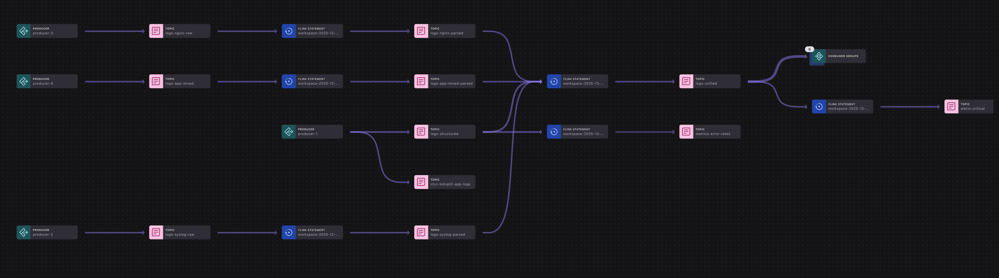

# Observability Demo with ShadowTraffic

A data generation setup for demonstrating Confluent Cloud Flink SQL capabilities with observability data: logs, metrics, and traces.

## Overview

This demo generates realistic observability data in multiple formats to showcase Flink SQL parsing, transformation, and real-time analytics capabilities.



| Topic | Format | Description |
|-------|--------|-------------|
| `logs-structured` | JSON | Clean application logs with trace correlation |
| `logs-syslog-raw` | RFC 3164 syslog | Raw syslog strings requiring regex parsing |
| `logs-nginx-raw` | Combined log format | Nginx access logs for latency analysis |
| `logs-app-mixed` | Multiple formats | Legacy app logs demonstrating format normalization |
| `telemetry-otel` | OTEL JSON | OpenTelemetry spans for distributed tracing |

## Prerequisites

- Docker
- [ShadowTraffic](https://shadowtraffic.io/) license
- Confluent Cloud account with:
  - Kafka cluster
  - Flink compute pool
  - Service account with appropriate RBAC permissions
- [1Password CLI](https://developer.1password.com/docs/cli/) (optional, for secrets management)

## Setup

### 1. Create Environment File

Copy and configure your environment:

```bash
cp env.example .env
```

Required variables:
```bash
CONFLUENT_BOOTSTRAP_SERVERS=pkc-xxxxx.region.cloud.confluent.cloud:9092
CONFLUENT_API_KEY=your-api-key
CONFLUENT_API_SECRET=your-api-secret

# ShadowTraffic License
LICENSE_EDITION=...
LICENSE_LEASE_KEY=...
LICENSE_LEASE_SIGNATURE=...
```

### 2. Configure RBAC Permissions

The service account needs these role bindings on your Kafka cluster:

```bash
# Replace with your values
SA=sa-xxxxx
ENV=env-xxxxx
CLUSTER=lkc-xxxxx

# Topic permissions (prefixed)
confluent iam rbac role-binding create --principal User:$SA \
  --role DeveloperManage --resource Topic:logs- --prefix \
  --environment $ENV --cloud-cluster $CLUSTER --kafka-cluster $CLUSTER

confluent iam rbac role-binding create --principal User:$SA \
  --role DeveloperWrite --resource Topic:logs- --prefix \
  --environment $ENV --cloud-cluster $CLUSTER --kafka-cluster $CLUSTER

confluent iam rbac role-binding create --principal User:$SA \
  --role DeveloperManage --resource Topic:telemetry- --prefix \
  --environment $ENV --cloud-cluster $CLUSTER --kafka-cluster $CLUSTER

confluent iam rbac role-binding create --principal User:$SA \
  --role DeveloperWrite --resource Topic:telemetry- --prefix \
  --environment $ENV --cloud-cluster $CLUSTER --kafka-cluster $CLUSTER
```

## Running the Demo

### Start Data Generation

```bash
# With 1Password secrets injection
op run --env-file=.env -- ./run_shadowtraffic.sh config.json

# Or directly if secrets are in .env
./run_shadowtraffic.sh config.json
```

ShadowTraffic will:
- Create topics automatically (6 partitions, replication factor 3)
- Generate continuous data streams until stopped (Ctrl+C)

### Verify Data

```bash
# Check topics exist
confluent kafka topic list --cluster $CLUSTER | grep -E "logs-|telemetry-"

# Sample syslog data
confluent kafka topic consume logs-syslog-raw --cluster $CLUSTER --from-beginning

# Sample nginx data  
confluent kafka topic consume logs-nginx-raw --cluster $CLUSTER --from-beginning
```

## Demo Queries

See [DemoOverview.md](DemoOverview.md) for complete Flink SQL queries including:

1. **Parsing Queries** - Transform raw logs into structured tables
2. **Unified Log View** - Normalize all sources into common schema
3. **Real-Time Analytics** - Error rates, latency percentiles, request volumes
4. **Alerting Streams** - Threshold-based alerts for SLA breaches
5. **Security Detection** - SSH brute force, suspicious IPs

## Data Formats

### Syslog (RFC 3164)
```
<173>Dec 09 19:38:04 cache-01 redis-server[35828]: Connection from 23.195.202.154 port 3301
```

### Nginx Combined
```
2.67.127.233 - - [09/Dec/2025:19:38:04 +0000] "DELETE /api/v1/orders HTTP/1.1" 200 30929 "https://www.google.com/" "Mozilla/5.0..." 0.154
```

### App Mixed (Multiple Formats)
```
2025-12-09 19:38:12,484 ERROR [pool-2-thread-20] org.springframework.DispatcherServlet - DB query took 50ms | rows=91
[2025-12-09 19:38:12,169] WARN: com.example.DatabasePool :: Cache stats - hits=1548 misses=45
```

## Configuration

The `config.json` file defines:

- **5 generators** producing to 5 topics
- **2 connections**:
  - `confluent-cloud` - JSON serializer for structured data
  - `confluent-cloud-raw` - String serializer for raw log formats
- **Throttling** - Configurable rates per generator
- **Realistic distributions** - Weighted status codes, log levels, latencies

## Cleanup

```bash
# Delete all demo topics
for topic in logs-app-mixed logs-nginx-raw logs-structured logs-syslog-raw telemetry-otel; do
  confluent kafka topic delete $topic --cluster $CLUSTER --force
done
```

## Troubleshooting

**"Group authorization failed"**
- Add DeveloperRead role for consumer groups:
  ```bash
  confluent iam rbac role-binding create --principal User:$SA \
    --role DeveloperRead --resource Group:confluent_cli --prefix \
    --environment $ENV --cloud-cluster $CLUSTER --kafka-cluster $CLUSTER
  ```

**"Topic authorization failed"**  
- Verify RBAC bindings exist for the topic prefix

**ShadowTraffic config errors**
- Ensure all environment variables are set
- Check JSON syntax: `cat config.json | python3 -m json.tool`

